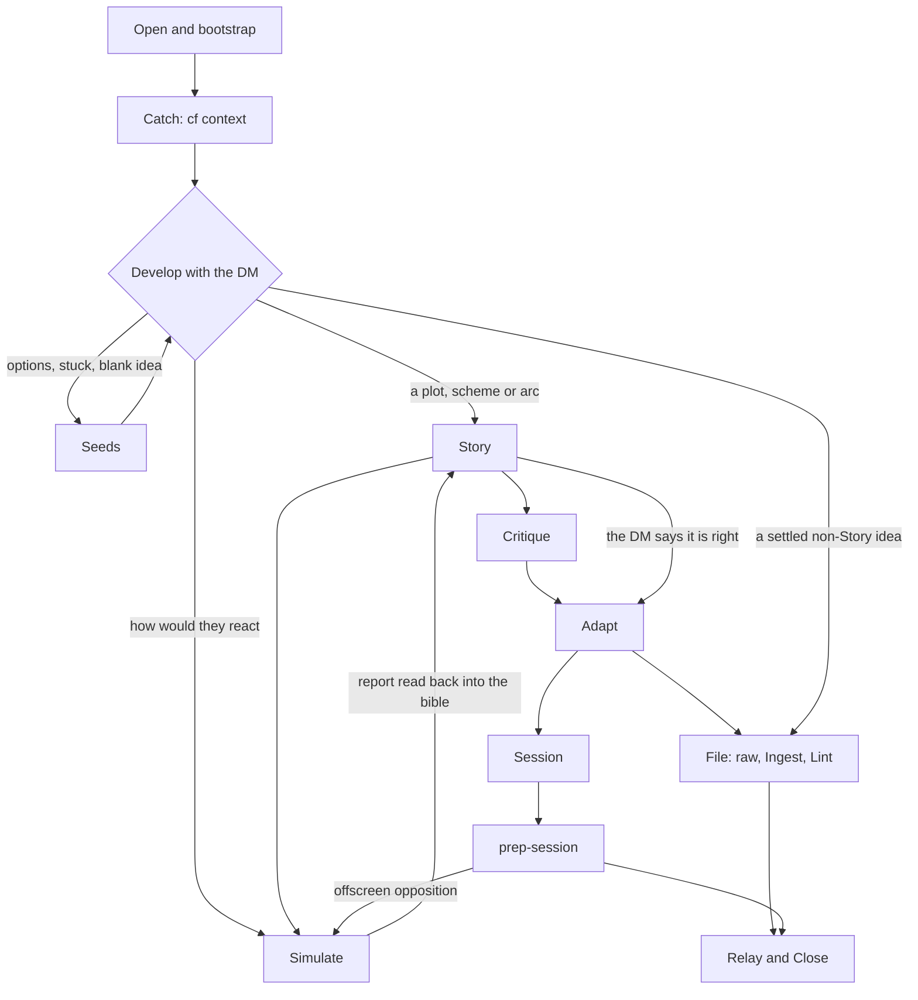

# Creative process

This is the map of how Campaign Foundry turns the DM's raw ideas into play. It lists each stage, working file, agent, helper and rule, with the file that defines each. Read that file before changing a behaviour. This page describes the system and contains none of its rules.

The DM starts every creative exercise with `/skill:collab-with-me`. The design decisions are in three ADRs:

- [0018 Story first, then adapt](adr/0018-story-first-then-adapt.md)
- [0019 Content follows the DM](adr/0019-content-follows-the-dm.md)
- [0020 Agent text passes the style gate](adr/0020-agent-text-passes-the-style-gate.md)

The terms (Story, Story Bible, Beat, Seed, Stance, Simulation, Persona, Director, Adaptation) are defined in [`CONTEXT.md`](../CONTEXT.md#creative-work).

## Stages

Each idea in a collab session has a `Stage` in the notes. The DM's words pick the next stage, so an idea can skip stages or loop back. The arrows show the usual paths.

|Stage|Owner|What it leaves behind|
|---|---|---|
|Open and bootstrap|[`collab-with-me`](../.omp/skills/collab-with-me/SKILL.md) step 1, whose table names the owner of each missing required file|`user-config.md`, the World, `campaign-config.md`, `hot.md` and the Story Bible, all read|
|Catch|`collab-with-me` step 2|each DM fragment in the notes, and the pages `cf context` listed on the read list|
|Seeds|[`docs/agents/co-writing.md`](agents/co-writing.md#seeds)|3 or 5 Seeds in the reply, each verdict in the notes|
|Story|[`references/story.md`](../.omp/skills/collab-with-me/references/story.md)|the Story Bible with its Story Outline of Beats, and prose drafts when the DM asks|
|Simulate|[`simulate-npcs`](../.agents/skills/simulate-npcs/SKILL.md)|dossiers, a ledger and a report of possibilities|
|Critique|[`references/story-critique.md`](../.omp/skills/collab-with-me/references/story-critique.md)|up to 7 findings and the 14 TTCW answers, relayed as talk|
|Adapt|[`references/adapt.md`](../.omp/skills/collab-with-me/references/adapt.md)|the adapted form of every bible section in the notes|
|Session|[`plan-session`](../.agents/skills/plan-session/SKILL.md)|a settled Session intent, handed to [`prep-session`](../.agents/skills/prep-session/SKILL.md)|
|File|`collab-with-me` step 5, then [`ingest`](../.agents/skills/ingest/SKILL.md) and [`lint`](../.omp/skills/lint/SKILL.md)|a `raw/` file of settled facts, then Wiki pages at `ok: 0 findings`|
|Relay and Close|`collab-with-me` steps 6 and 7|the DM told what was filed, what remains open, what is running and which Personas are idle|

Prep reaches the Simulate stage on its own: [`prep-session`](../.agents/skills/prep-session/SKILL.md) step 4 derives the opposition's unopposed timeline by running `simulate-npcs` for offscreen moves.

## Working files

|File|Holds|Lifetime|
|---|---|---|
|`local://collab/notes.md`|the per-idea ledger with each idea's `Stage`, the DM's settled statements and their Canon links, open questions, and every suggestion or Seed with the DM's verdict|the omp session; re-read after a context reset|
|`local://collab/bible.md`|the Story Bible|the omp session|
|`local://collab/sim/<slug>/`|one dossier per NPC (`<Npc>.md`) and the event `ledger.md`|the omp session|
|`local://collab/drafts/<slug>.md`|prose drafts, one Beat per heading|the omp session|
|`raw/collab-<YYYY-MM-DD>-<subject>.md`|the DM's settled ideas and adapted material, stated as plain fact|until Ingest archives it|
|Wiki pages|Canon|permanent|

Everything under `local://` stays outside the Wiki. Ingest files a Story into the Wiki only as adapted facts from a `raw/` file.

## Agents

|Agent|Definition|Dispatched by|Tools|Job|
|---|---|---|---|---|
|collab (the main agent)|`collab-with-me`|the DM|full|holds the conversation, does cheap reads and dispatches everything heavier|
|`creative-writer`|[`.omp/agents/creative-writer.md`](../.omp/agents/creative-writer.md)|co-writing Seeds, Story prose drafts and "show me versions"|`read`, `yield`|writes prose to a brief, optimising for any Stance the brief names|
|`persona`|[`.omp/agents/persona.md`](../.omp/agents/persona.md)|`simulate-npcs` step 3 only|none|plays one NPC from its dossier, one turn per Director command|
|Director|a native `task` subagent running `simulate-npcs`, or `prep-session` itself|collab's Simulate stage, or Prep step 4|full|frames scenes, commands each Persona and keeps the ledger|
|Critic|a fresh native `task` subagent with `story-critique.md`|collab's Critique stage|full, leaves the bible and drafts as they are|answers the TTCW tests and returns findings|
|`scout`|bundled|collab step 3|read-only|widens the Wiki search and returns relevant paths|
|Ingest, Lint and Prep runners|fresh native `task` subagents|collab steps 5 and 6|full|file, check and build one chain at a time|

Both `creative-writer` and `persona` default to `zai/glm-5.3` (pinned in their frontmatter; test runs use the flash variant per [`.omp/AGENTS.md`](../.omp/AGENTS.md#native-delegation)) with `blocking: false`, so collab can keep talking while they work. A Persona has `tools: []` on purpose. Without reads, it knows only its dossier and the events the Director sends it, so no Persona can learn another NPC's secrets.

The Director sends each Persona its turns with `write agent://<id>`. Personas are named `Persona<NpcNameCamelCase>`, and `read history://<id>` shows a Persona's whole transcript for an isolation check. Delegation rules for every agent are in [`.omp/AGENTS.md`](../.omp/AGENTS.md#native-delegation).

## Helpers

|Command|Reports|
|---|---|
|`bun run cf -- context [file\|-]`|every Wiki page whose name or alias appears in the text, one line each as path, type and matched name, sorted by type and then name; `--json` gives the same as objects|
|`bun run cf -- style [paths\|-]`|findings from the style (Vale) and narration layers alone, over any markdown files or directories, with the output and exit codes of `cf check`|
|`bun run lint:agent-text`|`cf style` over the paths in `package.json`'s `lint:agent-text` script, which defines agent-facing content text (ADR 0020)|

The helpers are diagnostic. Each `--help` says so: `Lists findings or pages; deciding what to change is the agent's job.` A page from `cf context` is a pointer to read, and its lore comes from the reading. A finding from `cf style` marks text for the agent to rewrite with judgement.

## TTSR rules

The TTSR rules in `.omp/rules/` interrupt an agent mid-output and point it back at the owner file. Each body is that pointer plus the rewrite to make.

- [`content-stance.md`](../.omp/rules/content-stance.md) is a judged rule over the text output of `creative-writer` and `persona`. Its question checks whether the output softens dark content the DM requested that no Line or Veil covers, and its body points at [Content stance](../AGENTS.md#content-stance). Judged rules run because [`.omp/config.yml`](../.omp/config.yml) sets `ttsr.judge: "on"`. Under the default `auto`, a missing native judge skips them silently.
- [`wiki-dashes.md`](../.omp/rules/wiki-dashes.md) is a regex rule on `write` and `edit` calls to `wiki/**/*.md`. It matches an em or en dash and names the gate rules `ai-tells.EmDashUsage` and `Narration.NoEmDash`.

## Rule owners

|Rule|Owner|
|---|---|
|Content rating and themes|[`AGENTS.md` Content stance](../AGENTS.md#content-stance)|
|Characters and prose speak in the World's terms, rules terms stay DM-side|[`AGENTS.md` In-world voice](../AGENTS.md#in-world-voice)|
|The only content limits|the Lines and Veils in each Campaign's `campaign-config.md`|
|The Agent's voice with the DM: talk form, yes-and, Canon and pitches, Seeds and Stances, ownership, quiet mode, questions|[`docs/agents/co-writing.md`](agents/co-writing.md)|
|Stage routing, bootstrap, working files and the filing chain|[`collab-with-me`](../.omp/skills/collab-with-me/SKILL.md)|
|Story Bible sections, Beats and the drafting brief|[`references/story.md`](../.omp/skills/collab-with-me/references/story.md)|
|The critique checklist and finding shape|[`references/story-critique.md`](../.omp/skills/collab-with-me/references/story-critique.md)|
|Story to table conversion|[`references/adapt.md`](../.omp/skills/collab-with-me/references/adapt.md), whose rows point at each form's owner|
|Simulation method|[`simulate-npcs`](../.agents/skills/simulate-npcs/SKILL.md)|
|How a Persona answers|[`.omp/agents/persona.md`](../.omp/agents/persona.md)|
|NPC voice lines and their check|[`npc-design` craft reference](../.agents/skills/npc-design/references/craft.md)|
|Session intent and its Playable checks|[`plan-session`](../.agents/skills/plan-session/SKILL.md)|
|Scene procedure|[`docs/agents/scene-pages.md`](agents/scene-pages.md)|
|Narration craft|[`theatre-of-the-mind`](../.agents/skills/theatre-of-the-mind/SKILL.md)|
|Flagged words and phrases|the Vale YAML in [`.vale/styles/ai-tells/`](../.vale/styles/ai-tells/) and [`.vale/styles/Narration/`](../.vale/styles/Narration/); skills cite the rule ID|
|Gate layers and passing-form hints|[`src/check/layers/`](../src/check/layers/)|
|Every gate finding binds|[`AGENTS.md`](../AGENTS.md) Working rules, Zero findings|
|What counts as agent-facing content text|`package.json`, script `lint:agent-text`|

## Iterating on the system

- **Friction.** Run [`dogfood`](../.omp/skills/dogfood/SKILL.md) on collab or on one stage with real ideas, and let `skill-writer` turn verified friction into text changes.
- **Content skills.** When a content skill's text changes materially, rerun its committed `evals/cases.yaml` through [`run-evals`](../.agents/skills/run-evals/SKILL.md), following [`evals/README.md`](../evals/README.md).
- **Agent text.** After any edit to an agent-facing content path, run `bun run lint:agent-text` to `ok: 0 findings`, and `bun run cf -- eval validate <skill-dir>` for each touched skill.
- **Research.** The sources behind every stage are in [`docs/research/creative-writing/`](research/creative-writing/README.md). Quoted prompts there are verbatim, so carry them into skills and briefs in fenced blocks with their wording intact.
